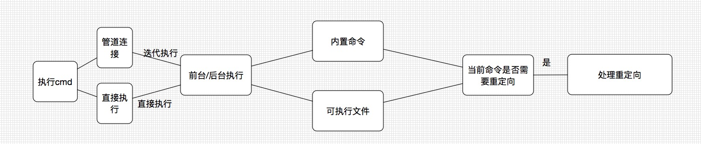

# 背景

## why a shell?

Shell是Unix程序的典型示例。它触及了Unix系统能够提供的所有有趣的功能。

它必须从STDIN读取输入，生成用户请求的进程，根据输入向进程发送信号，将进程与管道连接在一起，并为程序员提供脚本环境以完成工作。


## 做了这个项目能收获到什么？

- 多进程是怎么回事？
- 进程间如何通信？
- 进程资源如何回收？
- linux如何管理job？
- 前台后台进程是怎么回事？

# 使用


## 文件结构

tsh.py      : tsh启动main函数
pipe_demo.c : 管道实现demo（c语言）

./src: 程序主代码
- shell.py, shell驱动程序类
- jobs.py, job管理类
- log.py, 日志类

./data: 可执行程序
- my_sleep  : USAGE > sleep 10
- my_echo   : USAGE > my_echo helloworld

## 启动方式

```py
python3 tsh.py
```

## 支持的命令

```sh
quit
getgpid pid

my_echo helloworld

my_sleep 10
my_slepp 100 &

jobs
bg pid(use with 'my_sleep' command)
fg pid(use with 'my_sleep' command)

signal control(use with 'my_sleep' command):
    ctrl + z
    ctrl + c

(redirect and pipe control are not perfect currently)
my_echo helloworld > a_file 
my_echo helloworld | quit

```

# 设计目标

一个shell的雏形，不同技术分支的功能要能实现（内置命令、可执行文件、作业管理、重定向、管道）

## 实现的功能


- 能够执行内置命令 或 可执行文件

- 能够进行job管理

- 每个job有自己的信息

- 能够列出当前运行的所有job

    `jobs`

- 能够后台运行job（当然也能前台运行）

    `&`后缀

- 能够进行信号处理
- 能够回收所有的僵尸进程

    如果有的进程因为被信号中止而没有被回收，则需要打印出进程的信息

- 支持重定向


- 支持管道

# 设计思路及折衷


####  能够执行内置命令 或 可执行文件

通过分支进行执行，系统内部有的命令，直接调用功能。没有的，通过`exec*`函数进行执行。

#### 能够进行job管理

1. job id：PID/JID（%作为前缀）
2. job status：正在运行、结束（已终止、已停止）
3. job command：最好保存一下执行该job的命令，为后端debug做准备
4. signal handle：预先定义需要注意的信号（比如ctrl-c，ctrl-z）


#### 每个job有自己的信息

#### 能够列出当前运行的所有job

`jobs`

通过一个数组，管理多个进程，这个进程好像状态机一样，什么时候该变换状态

#### 能够后台运行job（当然也能前台运行）

`&`后缀

#### 能够进行信号处理

一个正在执行的进程是如何收到信号的？你理解这个并发的过程吗？多进程是怎么回事？


是否等子进程？如果children还在执行主进程是什么状态？这种情况称为孤儿（orphan）进程，通过重新分配给`init`进行管理，也就是为什么我们只需要打印一下就可以了。**这个场景是：子进程还在执行，但父进程被信号终止了。**

#### 能回收所有的僵尸进程

如果有的进程因为被信号中止而没有被回收，需要打印出进程的信息。
回收僵尸进程通过`waitpid`。

### 支持重定向


前置条件：需要先支持一个简单的ls -l（可执行程序）作为验证命令

简单来说就是将『标准输出』重定向到『某个文件描述符』，通过`dup2`

### 支持管道

知道底层os是怎么在管理**进程间通信**。
连续设置文件描述符，第一个fd为stdin，最后一个fd为stdout。


当目前为止，方案有没有想清楚？每个功能应该怎么设计有没有想清楚？

# 系统设计

当前系统主要的复杂度来自`job管理`和`SIGCHLD`信号的处理。jobController需要维护自己的状态，**何时改变状态是一个非常需要注意的决策**；`SIGCHLD`最主要的目的用于zombie的回收(`SIGEXITED`)，同时也包括`SIGSTOP`和`SIGCONTINUE`的管理（停止和继续）。

## 基本介绍

## 系统流程图及说明




## 与外部系统的接口
无

## 数据结构及说明

job的数据解构
上面列出了相关的功能，可以简单设计一个类：

```py
// pseudocode
class job:
    //参数
    pid
    jid
    string cmd
    status //后面可改为枚举

    //获取基本信息
    print_job_info_by_pid()
    print_job_info_by_jid()

    //获取到job对象
    get_job_from_pid()
    get_job_from_jid()
    set_status_pid()
    set_status_jid()

    //列出所有的job
    list_total_jobs()

    //信号处理
    signal_handle_kill()
    signal_handle_stop()
    signal_handle_continue()
```

#### 重定向：

```py
def redirect(in, out):
```

#### 管道

1. 分解当前命令（'|'）
2. 遍历多个命令，第一个的输入时`STDIN`，最后一个的输入`STDOUT`
3. 中间进行迭代重定向

```py
# pseudocode
def redirect(in, out, cmd):

in = STDIN

cmds = total_cmd.split('|')
for cmd in cmds:
    int current_fd
    if cmd is last_cmd:
        redirect(current_fd, STDOUT, cmd)

    redirect(in, current_fd, cmd)
    in = current_fd

```

## 异常处理

EOFError:
- ctrl-D触发

OSError: 
- FileNotFoundError: execv()执行不存在的文件会报错，执行路径从`./data`里面找
- ChildProcessError: [Errno 10] No child processes
    - 发生**抢占zombie**时汇报错（正常退出`_exit` + SIGCHLD处理）


